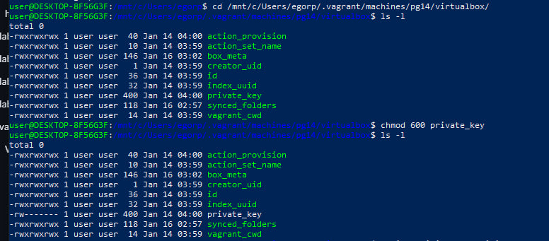
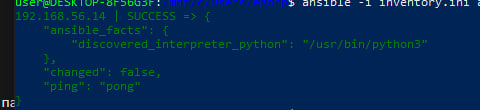
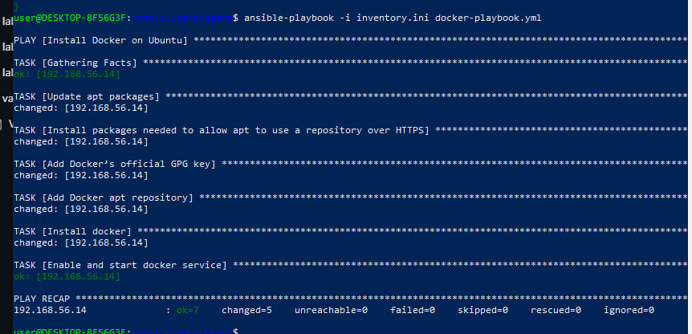

## **Ход работы**

1. Установить Ansible используя ([Гайд по установке](https://docs.ansible.com/ansible/latest/installation_guide/intro_installation.html))
2. Установить Vagrant ([Гайд по установке](https://developer.hashicorp.com/vagrant/downloads))
3. Поднять Vagrant хост из ссылки при помощи файла Vagrantfile используя команду ***vagrant up** ([VagrantFile](https://drive.google.com/drive/u/0/folders/1Ev8N8LijxNR2npEwhoUFlxBuznf--ujP))
4. Написать inventory-файл для развернутых хостов
5. Написать плейбук для установки Docker
6. Клонировать репо ([Репозиторий](https://github.com/mdn/django-locallibrary-tutorial)) на ноды группы [app]
7. Запустить приложение на нодах группы [app] используя ansible
---
## **План раската**

### **Vagrant**
Устанавливаем на свою машину Vagrant с официального сайта.
- проверяем установка при помощи <code>vagrant --version</code>
- переходим в папку, где лежит *Vagrantfile* <code>/path/to/vagrantfile</code>
- прописываем <code>vagrant up</code> и ждем, пока поднимутся виртуалки и туда подтянутся образы *ubuntu*.
- проверяем при помощи <code>vagrant status</code>
```
vagrant status
Current machine states:

pg12                      running (virtualbox)
pg14                      running (virtualbox)
pg16                      running (virtualbox)

```
(не забываем установить virtualbox для работы vagrant) 

### **Ansible**
Так как *ansible* не поддерживается на Windows, то для его использования нужно установить wsl при помощи <code>wsl --install</code><br>
```
sudo apt update
sudo apt install ansible
```
- проверяем при помощи
```
~$ ansible --version
ansible [core 2.16.3]
  config file = None
  configured module search path = ['/home/user/.ansible/plugins/modules', '/usr/share/ansible/plugins/modules']
  ansible python module location = /usr/lib/python3/dist-packages/ansible
  ansible collection location = /home/user/.ansible/collections:/usr/share/ansible/collections
  executable location = /usr/bin/ansible
  python version = 3.12.3 (main, Nov  6 2024, 18:32:19) [GCC 13.2.0] (/usr/bin/python3)
  jinja version = 3.1.2
  libyaml = True
...
- для лабораторной потребуется **docker-playbook.yml** и **inventory.ini**. <br>
**inventory.ini** - конфиг для группы хостов. <br>
**docker-playbook.yml** - содержит список выполняемых задач на каждом из хостов, указанных в  *inventory.ini*.
<br>
<br>
- при помощи <code>ansible all -i inventory.ini -m ping</code> пингуем наши машины, поднятые при помощи *vagrant* и ожидаем ответа **pong** от каждой из них. Для этого меянем права доступа к ключу в виртуалке.<br>


- в случае успеха запускаем задачи из playbook для каждого хоста из .ini: <code>ansible-playbook -i inventory.ini docker-playbook.yml</code>, дожидаемся раската конфигов на машинах и ответа от сервера.<br>

