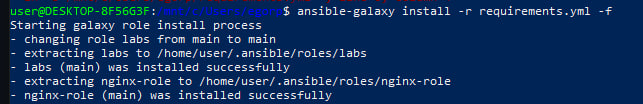
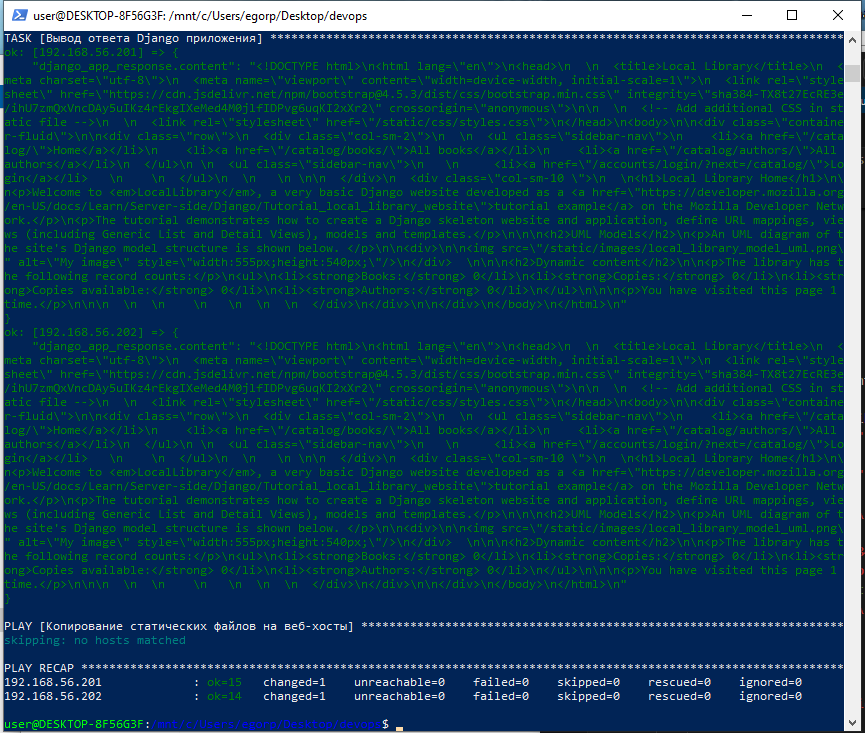

## **Ход работы**

1. Поднять Vagrant-окружение при помощи файла Vagrantfile, используя команду **vagrant up**
2. Написать роль для установки nginx, запушить в репозиторий и добавить в requirements.yml
3. Подготовить в инвентори шаблон конфигурационного файла для Nginx и для default-сайта, с настройками для отдачи статических файлов
4. Учесть в шаблоне проксирование динамики в контейнер с Django
5. Написать плейбук установки через роли nginx на хосты группы web, и docker на хосты группы app

Запустить приложение на хостах группы app или подготовить docker-compose.yml для запуска приложения

## **План раската**

- для начала проверяем, что все прилаги и версии подтянуты из [Readme](https://gitlab.com/devops9824703/nginx-role.git)

### **Vagrant**
Поднимаем машины

```bash
vagrant up
```

```bash
vagrant status
```
```
Current machine states:

srv1                      running (virtualbox)
srv2                      running (virtualbox)
```

### **Ansible**

#### **Ansible-galaxy**
Прописываем в wsl 
```bash
ansible-galaxy init nginx
```
, что создаст базовую структуру для роли nginx <br>

После чего создастся директория ```nginx``` <br>
Нам необходимо в: 
- *nginx/defaults/main.yml* создать переменные.
- *nginx/tasks/main.yml* перенести задачи по поднятию nginx и использовать вместо значений переменные из *defaults*.
- *nginx/handlers/main.yml* добавить handler на перезагрузку nginx.
- *nginx/templates/nginx.conf.j2* прописать конфиг для поднятия и прокси nginx на хосты [app].

### *Gitlab*

Запушить в уже созданную группу *nginx*

---
### *Ansible*

### *Ansible-galaxy*

- Создаем файл requirements.yml
- Прописываем в нем имя роли, ссылку на репу с ролью, указываем *main* в качестве src.
- в WSL прописываем 
```bash
ansible-galaxy install -r requirements.yml -f
```


- Добавляем роль в *docker-playbook.yml* (roles) и запускаем
```bash
ansible-playbook -i inventory.ini lab3playbook.yml
```

В ответе получаем:
<details>

<summary>Ответ</summary>



</details>