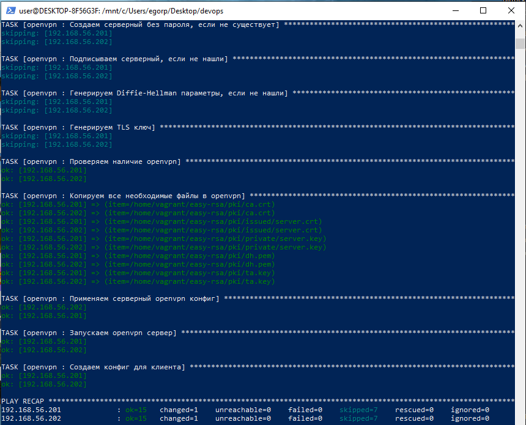

# Лабораторная работа №4: Тестирование ролей Ansible с помощью Molecule

В данной работе необходимо написать Ansible-роль для поднятия **OpenVPN-сервера** и протестировать её с помощью **Molecule**. В конце будет использоваться итоговая роль через `ansible-galaxy`.

---

## Цель работы

1. Научиться писать Molecule-тесты для Ansible-ролей.
2. Научиться поднимать OpenVPN-сервер средствами Ansible.
3. Получить артефактный `.ovpn`-файл для клиента.
4. Подключать написанную роль через `requirements.yml` (ansible-galaxy).

---

## Рекомендуемая документация

- [Habr об OpenVPN](https://habr.com/ru/post/233971/)
- [VPN: ещё раз просто о сложном](https://habr.com/ru/post/534250/)
- [Урок из Школы DevOps: Тестирование ролей в Molecule (YouTube)](https://www.youtube.com/watch?v=0b3YXlffo1Q)
- [Тестируем роли Ansible при помощи Molecule (Habr)](https://habr.com/ru/post/437216/)

---

## Предварительные требования

1. **Ansible** установлен (в WSL или Linux).
2. **Molecule** установлен — желательно в виртуальном окружении (venv) или через `pipx`.
   - Например:  
     ```bash
     python3 -m venv venv
     source venv/bin/activate
     pip install --upgrade pip
     pip install molecule[docker]
     ```
     (или `molecule[vagrant]`, если хотите тестировать во Vagrant.)
3. **Git** для управления репозиторием.

---

## Ход работы

### Шаг 1. Создаём базовую структуру роли OpenVPN

1. Инициируем роль (рекомендуется отдельный репозиторий, например `openvpn-role`):
   ```bash
   ansible-galaxy init openvpn
   ```

   openvpn/
├── defaults/
├── handlers/
├── meta/
├── tasks/
├── templates/
├── tests/
├── vars/
└── ...

```
molecule init scenario --driver-name vagrant default
```

```
ansible-galaxy install -r requirements.yml
```


```
ansible-playbook -i inventory.ini openvpn-playbook.yml
```


