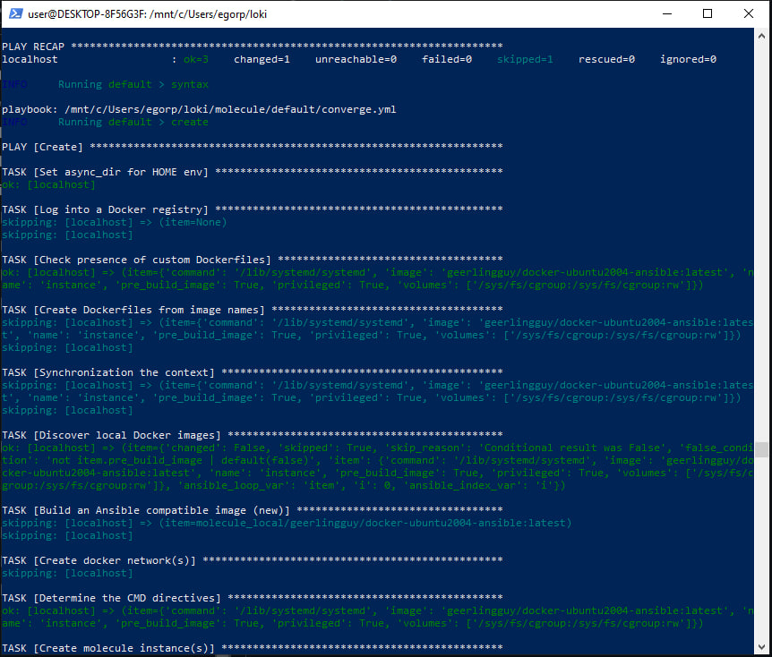

## **Ход работы**

1. Развернуть виртуальную машину для приложения (app) и виртуальную машину для будущей системы мониторинга (monitoring) через Vagrant-file
2. Написать Ansible Playbook для развертывания системы мониторинга и приложения
3. Через molecule разработать отдельные Ansible-роли для развертывания Grafana, Prometheus, Loki, Docker и пр. Использовать Galaxy для хранения ролей, роли должны проходить стандартные “molecule test”
4. Установить на monitoring сервисы Grafana, Prometheus и Loki
5. Установить на app само приложение и настроить сбор метрик из app /actuator/prometheus
6. Разработать шаблоны для конфигурационных файлов поднимаемых сервисов
7. Добавить в шаблоны дашборды графаны и визуализировать метрики
8. **Добавить в шаблоны алертинг в виде письма на почту**

- Создаём все роли:

```
ansible-galaxy init docker-role
ansible-galaxy init prometheus-role
ansible-galaxy init grafana-role
ansible-galaxy init loki-role
```

- После заполнения ролей тестируем:

```
molecule init scenario --driver-name docker default
molecule test
```



- Запускаем после заполнения всех плейбуков:

```
ansible-playbook -i lab6.ini requirements.yaml
```